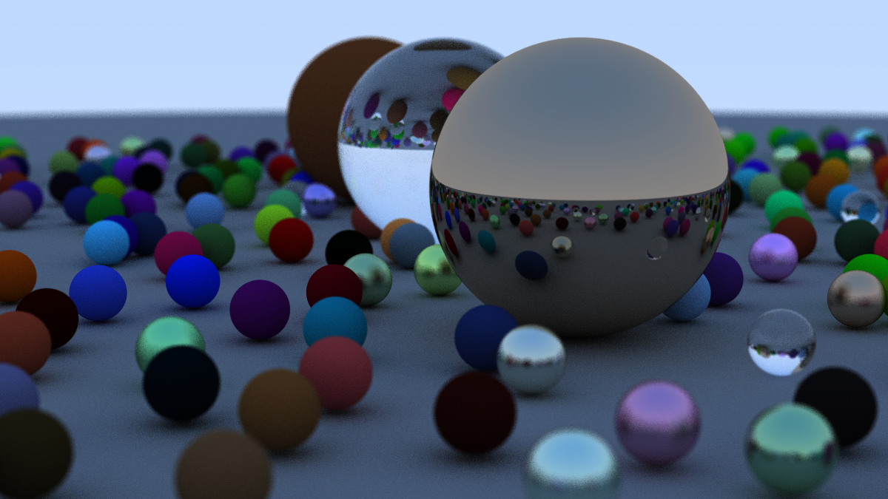

# JuliaRayTracing

This repository is my attempt to adapt the C++ code presented in [Ray Tracing in One Weekend by Peter Shirley](https://raytracing.github.io/books/RayTracingInOneWeekend.html) to Julia. The code structure is very similar to the one in the book.

To run, execute the file main.jl. This will automatically activate the JuliaRaytracing environment. The code depends on [PNGFile.jl](https://github.com/JuliaIO/PNGFiles.jl) for saving the render in the .png format.

Here is a render of the final scene made with this code:

